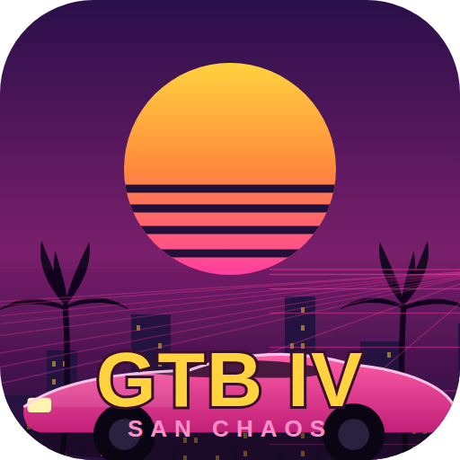

# Grand Turbo Boost IV: San Chaos

A neon-soaked, 3D open-world crime sandbox for mobile browsers. Play as
**Turbo Jones**, a small-time crook trying to get his life together in **San
Chaos City** — steal cars, fly helis, dodge cops, and cause chaos, all wrapped
in an evolving story told in chapters. The premise is absurd; it's played
completely straight (see `STORY_BIBLE.md` for the tone and canon).

Built as a single self-contained HTML5 page using [three.js](https://threejs.org)
for the 3D world and the Web Audio API for engine sounds, a fully procedural 80s
**synthwave soundtrack** (sidechain-pumped, reverb-drenched radio with a song
per station), and recorded voiceover. Designed for **landscape** phones and
installable as a PWA.

<p align="center"></p>

## Play it

The game loads its audio with `fetch()`, so it **must be served over HTTP** —
opening `index.html` directly from the filesystem (`file://`) will silently drop
the sound. Any static server works:

```bash
# from the repo root
python3 -m http.server 8099
# then open http://localhost:8099/index.html
```

### Host it on GitHub Pages

This repo is a static site at the root, so it deploys with no build step:

1. Push this branch to GitHub.
2. Repo **Settings → Pages → Build and deployment → Deploy from a branch**.
3. Pick the branch and the **`/ (root)`** folder, save.
4. Open the published URL on your phone and **Add to Home Screen** to install
   it as a fullscreen app (uses `manifest.json` + the app icons).

## Controls

Touch and keyboard/mouse controls are shown/hidden automatically based on
whether the primary input is a touch screen (`(pointer:coarse)`) — you won't
see a phone joystick on a desktop browser, or keyboard hints on a phone.

| Action | Touch | Desktop |
| --- | --- | --- |
| Move | Left thumb stick | `W` `A` `S` `D` |
| Look around | Swipe right side of screen | Drag right side |
| Drive: gas / brake | On-screen pedals | `W` / `S` |
| Boost / drift | On-screen pedal buttons | `Shift` / `Space` |
| Enter / steal vehicle | On-screen button | `E` |
| Punch / fists / gun | On-screen button | `F` |
| Cycle weapon | On-screen button | `G` |
| Aim (gun equipped) | Right-thumb swipe moves the reticule; Turbo faces it | Drag right side |
| Bail out of heli / open parachute | BAIL OUT then CHUTE button | `E` then Space |
| Feed / throw meat (dog packs) | On-screen button | `V` |
| Dismiss your dog pack | On-screen button | `B` |
| Talk to a pedestrian | On-screen button | `T` |
| Jump | On-screen button | Space |
| Horn | On-screen button | `H` |
| Radio | Tap ♪ | `Q` |
| Replay last 30 s (free camera) | REPLAY button | `R` (Space = play/pause, Esc = exit) |
| Day / night | — | `N` |
| Crouch | — | `C` |
| Pizza Wars mission | — | `M` |
| Pause | Pause button | `P` / `Esc` |

The game never asks a phone to physically rotate — a portrait touch device
self-rotates the page to landscape instead (see `HANDOFF.md` §6.7 for how).

## Core loop

The permanent, always-on gameplay — this doesn't change chapter to chapter:

- **Make money.** Stick people up with the pistol, rob glowing stores, run
  pizza deliveries, and take on side-missions (`delivery`, `style`,
  `checkpoints`, `rampage`, `heat`) for cash.
- **Manage heat.** Every crime raises your wanted level; cops (and cop helis)
  escalate with it. Break line of sight or lay low in a rooftop hideout to cool
  off.
- **Explore & cause chaos.** A full procedural city — streets, an elevated
  light rail, rooftops and fire escapes, a beach and open water — driveable by
  car, bike, or helicopter, on foot, or on a rampage.
- **Follow the story.** A running narrative delivers goals, cutscenes, and
  rival characters on top of the sandbox. The **current chapter's specific
  objectives** live in-game (follow the HUD/beacon) and in `STORY_BIBLE.md` /
  `CHAPTER1.md` — those evolve as the story grows, so they're not duplicated
  here. Progress (money, story flags, settings) is saved automatically.

## Repo layout

Everything sits flat at the repo root because the game references assets with
plain relative paths.

| File | Purpose |
| --- | --- |
| `index.html` | The entire game (markup, styles, and logic) |
| `AGENTS.md` | **Mission control — read first.** Agent roster, the repo-as-message-bus handoff protocol, and the live task board every agent/human works from |
| `GAME_PLAN.md` | Top-level map — verified state-of-the-game report, the Places & Loading growth architecture, and the multi-agent (code + graphics) asset pipeline |
| `ASSETS.md` | Art-generation guide — San Chaos style DNA, which image tool (Midjourney/Nano Banana/Kimi) to use for what, per-subject prompt recipes (cars, people, trees, buildings…), and the mobile texture budget |
| `HANDOFF.md` | Engineering handoff — architecture, code map, and the prioritised improvement backlog for contributors |
| `CHARACTERS.md` | Character-model, paint/creator, and cutscene-rendering plan (companion to `HANDOFF.md`) |
| `STORY_BIBLE.md` | Story & script-writing framework — canon, voice, world, and mission/cutscene templates for narrative work |
| `CHAPTER1.md`, `FOOTBALL_STRAND.md` | Scripts for the next chapter of missions/cutscenes (store robberies, cop chases, the football side-strand) |
| `tests/` | Headless regression suite (state/logic, not visuals) — `cd tests && node run.js`. See `tests/README.md` |
| `TURBO_LINES.md`, `DEB_LINES.md`, `VOICE_LINES.md`, `VOICE_LINES.csv` | Full voice-line scripts per character, prepped for TTS/voice-casting generation (CSV is the batch-export format) |
| `three.min.js` | Vendored three.js r128 (see note below) |
| `manifest.json` | PWA manifest — name, icons, fullscreen/landscape |
| `icon-512.png`, `apple-touch-icon.png` | App / home-screen icons |
| `title-bg.jpg` | Title-screen background art |
| `art/` | Committed game art (facades, sky, loading splashes, UI) — see `art/README.md` for the layout + mobile texture budget. `art/legacy/` holds the retired `panel1-3.jpg` key-art placeholders (no longer referenced) |
| `voice/` | All recorded voice audio — see below |

### Voice audio layout (`voice/turbo/…`)

All recorded dialogue lives under `voice/<character>/` — today that's just
`turbo/`, since Turbo is the only character with recorded audio (everyone
else is still script-only in `VOICE_LINES.md`). **`voice/turbo/ambient/` and
`voice/turbo/intro/` are the two folders `index.html` actually `fetch()`s —
edit those and the game hears it immediately.** Everything else under
`voice/turbo/` is recorded and organized but not yet wired into any gameplay
trigger (see `HANDOFF.md` §6.6 for the wiring convention and what's next).

| Folder | Wired into the game? | Contents |
| --- | --- | --- |
| `voice/turbo/intro/` | **Yes** — `INTRO_LINES` | The 4-line shipped intro narration |
| `voice/turbo/ambient/approach/` | **Yes** — `TURBO_LINES.approach` | Talking to a pedestrian (12 lines) |
| `voice/turbo/ambient/punch/` | **Yes** — `TURBO_LINES.punch` | Punch catchphrases (11 lines) |
| `voice/turbo/ambient/driving_slow/` | **Yes** — `TURBO_LINES.slow` | Driving too slow (9 lines) |
| `voice/turbo/ambient/red_light/` | **Yes** — `TURBO_LINES.stopsign` | Running a red light (9 lines) |
| `voice/turbo/ambient/chased/` | **Yes** — `TURBO_LINES.cops` | Cop-chase catchphrases (11 lines) |
| `voice/turbo/ambient/run_over/` | **Yes** — `TURBO_LINES.runover` | Running someone over (7 lines) |
| `voice/turbo/ambient/firing/` | **Yes** — `TURBO_LINES.shoot` | Shooting catchphrases (6 lines) |
| `voice/turbo/ambient/carjack/` | **Yes** — `TURBO_LINES.car` | Stealing a car catchphrases (6 lines) |
| `voice/turbo/backstory_intro/` | Not yet | Extended 13-line intro/backstory monologue (alternate to the shipped 4-liner) |
| `voice/turbo/story/` | Not yet | `approach_deb/`, `idle_backstory/`, `idle_debt/`, `paying_deb/`, `pizza_jack/`, `robbery/`, `robbery_take/`, `turbo_bowl_run/`, `turbo_bowl_scoring/`, `turbo_bowl_tackled/` — `CHAPTER1.md`/`FOOTBALL_STRAND.md` barks, staged ahead of the missions that will use them |
| `voice/turbo/cutscenes/` | Not yet | `coach_defeat/`, `coach_rematch/`, `danny_apology/`, `first_score/`, `turbo_bowl_payoff/` — named cutscene dialogue for the football strand |
| `voice/turbo/promo/` | No (not gameplay) | Trailer/store-listing voiceover |
| `voice/turbo/raw/` | No | Voice-casting auditions and test renders, kept for reference only |

**Adding new voice-acting drops:** put each new batch in its own folder
under `voice/<character>/`, following the same `category/lowercase_line_slug.mp3`
naming used above (e.g. `voice/deb/ambient/…`, `voice/turbo/story/new_scene/…`).
Numbered filenames (`xxx_01_slug.mp3`) should stay in the same left-to-right
order as the matching script in `TURBO_LINES.md`/`DEB_LINES.md` so the mapping
into `index.html` is a straight line-by-line read. Nothing needs to move once
it's in the right folder — an engineer just adds the `{src:'voice/…', text:…}`
entries to wire it up.

### three.js is vendored, not from a CDN

The original build pulled three.js r128 from a CDN. It's now committed locally as
`three.min.js` (the official npm `three@0.128.0` build) and loaded with a
relative `<script src="three.min.js">`. This makes the game self-contained: no
external dependency, no single point of failure, and it works offline once the
page is cached.

### Placeholder art

The app icons (`icon-512.png`, `apple-touch-icon.png`) and `title-bg.jpg` are
**synthwave placeholders** generated to match the game's aesthetic so nothing
renders blank. Drop final art in at the same paths/filenames to replace them —
no code changes needed. New art beyond these (facades, sky, UI, etc.) goes
under `art/` — see `art/README.md` for the layout and mobile texture budget.

## Credits

- Game design & code prototyped with **Kimi**.
- Composed, wired up, tested, and vendored into this repo with **Claude Code**.
- Voiceover & sound effects: provided audio assets.
